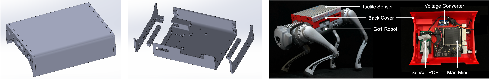

## Mac Mini for Onboard Robotics

This repository provides guidance on:
(a) adapting a **Mac Mini (M2 Pro)** as an onboard computer for robots;
(b) running control policies on it using the **Asahi-Linux** system.
In addition, it includes the shell design source files (SolidWorks 2024) for open customization.

#### Instructions
- **Prepare the necessary components:**
  - A [Mac Mini (M2 Pro)](https://www.apple.com/shop/product/FNH73LL/A/refurbished-MacMini-apple-m2-pro-chip-with-10%E2%80%91core-cpu-and-16%E2%80%91core-gpu)
  - A [voltage converter](https://a.co/d/ifEXSJT)
  - Two cables to connect the robot’s power supply, the converter, and the Mac Mini
  - A voltmeter to calibrate the converter output to match the Mac Mini input (12.6V)
  - Basic tools for installation and soldering; a 3D printer
  - Additional hardware (e.g., screws, nuts, heat inserts) depending on the selected shell

- **Verify software compatibility before disassembly:**
  - Follow the [Asahi-Linux](https://asahilinux.org/) guide to install Fedora, enabling Linux support on the Mac Mini
  - If ROS is required, follow the [RoboStack](https://robostack.github.io/GettingStarted.html#installation-ros) guide to create a virtual environment and install ROS1 Noetic on Fedora
  - Refer to [Jumping CoD](https://jumping-cod.readthedocs.io/en/latest/real_robot_setup.html) for additional details (e.g. reasons for choosing Mac Mini)
  - If your software setup is verified to work properly, proceed to the next steps.

- **Disassemble the Mac Mini** using the [guide](https://www.youtube.com/watch?v=AKKwOX-zxWs)

- **Choose and build a shell for your robot**
  - **[Compact Shell ( M2 Pro)](shells/MacMini_M2Pro_Shell_Compact/)**
    - Ready-to-use with Go1
    - Easily adaptable for other robots with minor modifications
    - Additional required components: [screws](https://a.co/d/f4Yv9HX) (3xM3-8 for the Mac Mini, 4xM3-6 for the shell, 1xM2-6 for the converter, 1xM2-4 for the button, 4xM4-12 with nuts for fastening the shell on the Go1 rails)
    - Example usage: [LocoMan](https://linchangyi1.github.io/LocoMan/). Note that two voltage converters are shown here, but the second one is only required for LocoMan’s servos. For standard usage, a single converter is sufficient.
      
  
  - **[Full-Back Shell (M2 Pro)](shells/MacMini_M2Pro_Shell_Full-Back/)**
    - Covers the entire back of Go1
    - Not recommended to modify for other robots
    - Additional required components: [heat inserts](https://a.co/d/fz0ot12) and [screws](https://a.co/d/f4Yv9HX) (3xM4-8 for the Mac Mini, 14xM3-8 for the shell, 2xM2-4 with flat washers for the converter, 1xM2-8 with a flat washer and a nut for the button, 10xM3-8 for the Go1-shell connectors)
    - Example usage: [LocoTouch](https://linchangyi1.github.io/LocoTouch/). Note that the custom PCB shown here is only required for LocoTouch’s tactile sensor; for standard usage, it is not needed.
      


#### Contributors:
- [Yuxiang](https://yxyang.github.io/) developed the initial onboard deployment pipeline using the Mac Mini (M1) ([Fast and Efficient Locomotion](https://sites.google.com/view/fast-and-efficient), [CAJun](https://yxyang.github.io/cajun/), [Jumping CoD](https://yxyang.github.io/jumping_cod/)).
- [Changyi](https://linchangyi1.github.io/) designed mounting shells for the Mac Mini (M2 Pro) ([LocoMan](https://linchangyi1.github.io/LocoMan/), [LocoTouch](https://linchangyi1.github.io/LocoTouch/)).
- Next contributor? Go2? H1? G1? M4?

#### Acknowledgement:
- [Erwin](https://www.linkedin.com/in/erwincoumans/) pioneered the idea of using a Mac Mini for onboard deployment, as first demonstrated in [Fast and Efficient Locomotion](https://sites.google.com/view/fast-and-efficient).


#### Citation:
If you find this repository useful, please cite:
```bibtex
@misc{MacMini_Onboard_Robotics_2025,
  title = {Mac Mini for Onboard Robotics},
  author = {Yuxiang Yang and Changyi Lin},
  year = {2025},
  url = {https://github.com/linchangyi1/MacMini_for_Onboard_Robotics},
  note = {GitHub repository}
}
```
